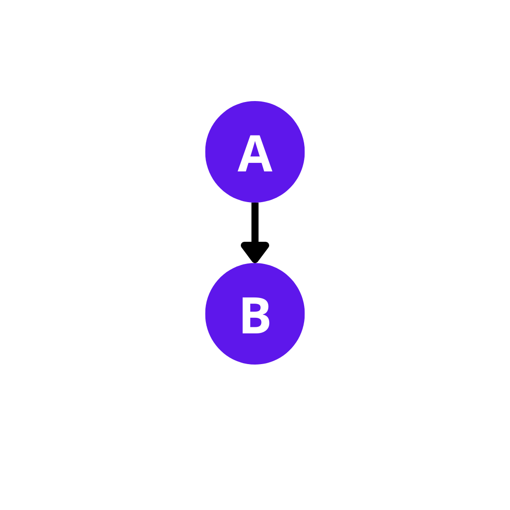
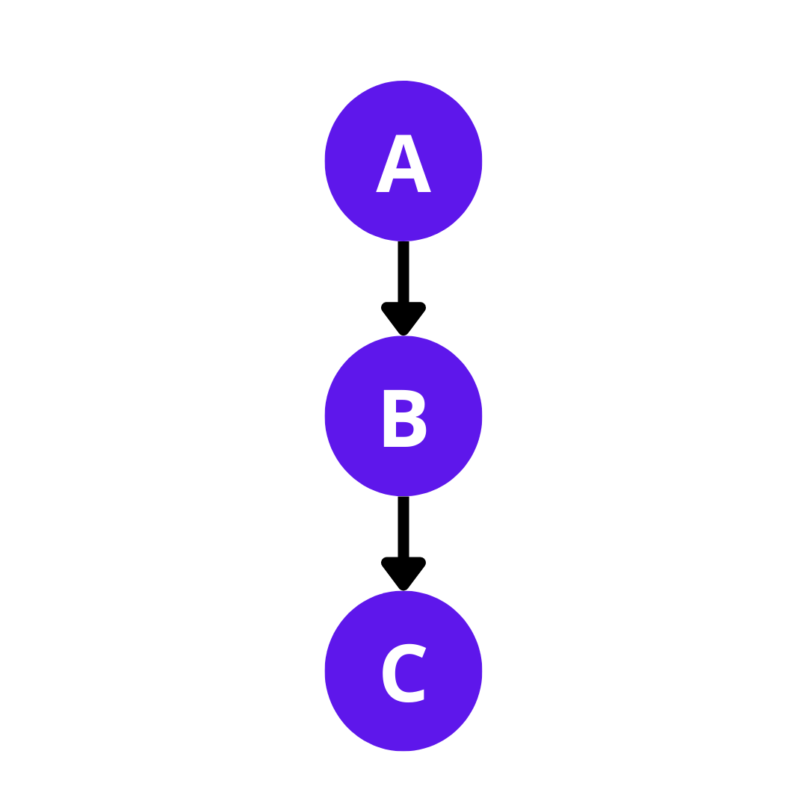
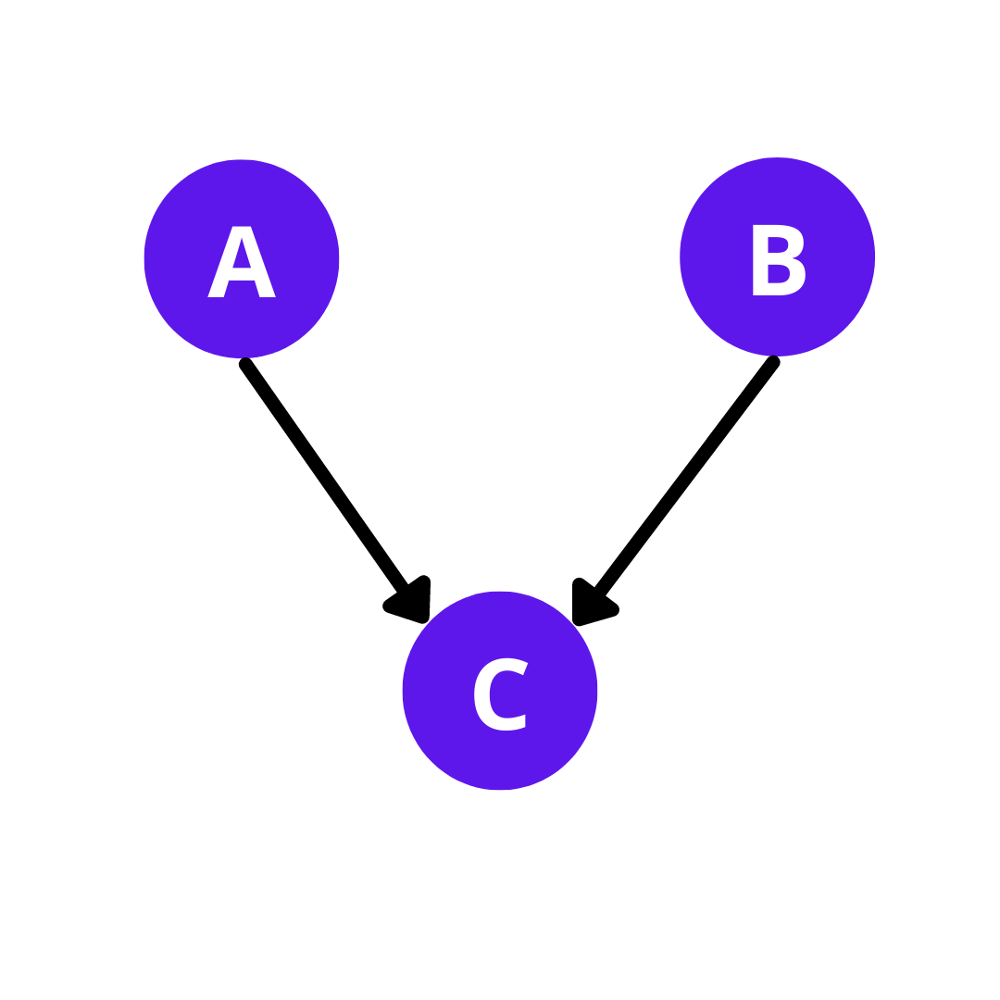
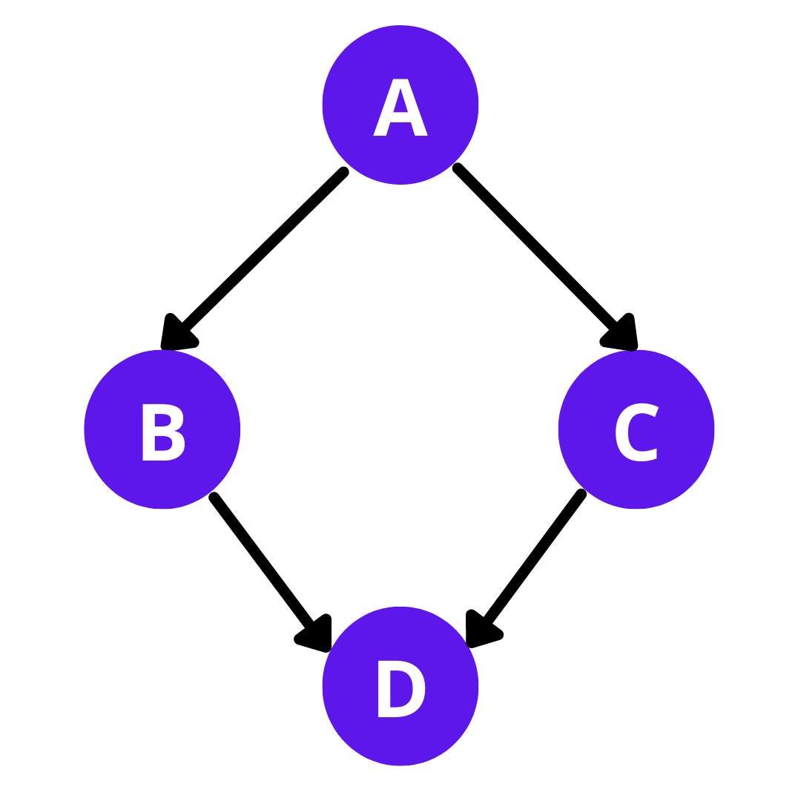

# Inheritance
  The process in which an object acquires all the properties and behaviour from the parent object automatically.

  **Advantages**
  - Code Reusability.

## Types of Inheritance
  - Single Inheritance
  - Multiple Inheritance
  - Hierarchial Inheritance
  - Multilevel Inheritance
  - Hybrid Inheritance

### Single Inheritance
  It is defined as the iheritance in which derived class is inherited from only one base class.
  
  

    class A{
        public:
        int k=5;
    };

    class B: public A{
        public:
        int c=10;
    };
    
### Multilevel Inheritance
  It is a process of deriving a class from another derived class.
  
  
    class A{
        public:
        int k=5;
    };

    class B: public A{
        public:
        int c=10;
    };

    class C: public B{
        public:
        int m=8;
    }
 
### Multiple Inheritance
  The process of deriving a class that inherits the attributes from two or more classes.
  
  
    class A{
        public:
        int k=5;
    };
    class B: {
        public:
        int c=10;
    };

    class C: public A,public B{
        public:
        int m=1;
    };
   
### Hybrid Inheritance
  The process of deriving a class from two or more derived classes.
  

    class A{
        public:
        int k=5;
    };
    class B:public A {
        public:
        int c=10;
    };
    class C:public A {
        public:
        int p=3;
    };
    class D: public C,public B{
        public:
        int m=1;
    };
    
### Hierarchical Inheritance
  The process of deriving more than one class from a single base class.
  
  
    class A{
        public:
        int k=5;
    };
    class B:public A {
        public:
        int c=10;
    };
    class C:public A {
        public:
        int p=3;
    };
    class D: public A{
        public:
        int m=1;
    };
    
